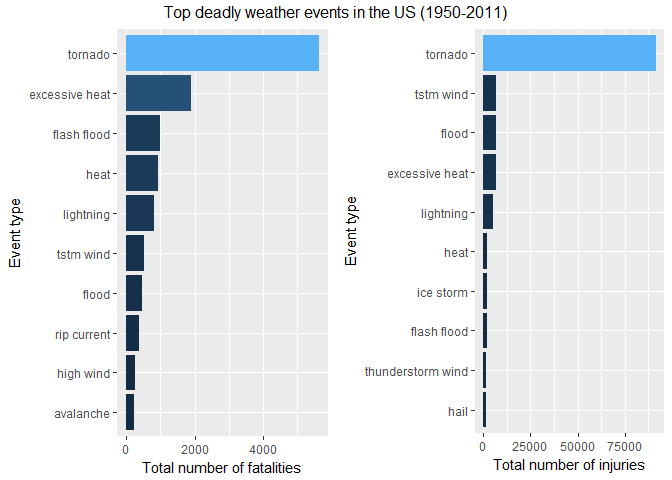

# Storm Data Analysis

# Health and Economic Impact of Storms and Other Weather Events in the United States
Storms and other severe weather events can cause both public health and economic problems for communities and municipalities. Many severe events can result in fatalities, injuries, and property damage, and preventing such outcomes to the extent possible is a key concern.

This project involves exploring the U.S. National Oceanic and Atmospheric Administration's (NOAA) storm database. This database tracks characteristics of major storms and weather events in the United States, including when and where they occur, as well as estimates of any fatalities, injuries, and property damage.

Using the NOAA storm database, we aim to answer the following questions:
1. Which type of events are most harmful with respect to population health?
2. Which type of events have the greatest economic consequences?

# Synopsis
The analysis on the storm event database revealed that tornadoes are the most dangerous weather event to the population health causing both death and injury. The next most dangerous event types causing death are excessive heat and flash floods and 

The economic impact of weather events was also analyzed. Floods and hurricanes caused billions of dollars in property damages between 1950 and 2011. The largest crop damage is caused by drought, followed by flood. Overall, flood cost the US economy around $15 billion due to damage to property and crops.

# Data
The data comes from the U.S. National Oceanic and Atmospheric Administration's (NOAA) and is in form of a comma-separated-value file compressed via the bzip2 algorithm to reduce its size. 

- [Storm Data](https://d396qusza40orc.cloudfront.net/repdata%2Fdata%2FStormData.csv.bz2)

Documentation of the database is available and describes how some of the variables are constructed/defined.

- [National Weather Service Storm Data Documentation](https://d396qusza40orc.cloudfront.net/repdata%2Fpeer2_doc%2Fpd01016005curr.pdf)
- [National Climatic Data Center Storm Events FAQ](https://d396qusza40orc.cloudfront.net/repdata%2Fpeer2_doc%2FNCDC%20Storm%20Events-FAQ%20Page.pdf)

The events in the database start in the year 1950 and end in November 2011. In the earlier years of the database there are generally fewer events recorded, most likely due to a lack of good records. More recent years should be considered more complete.

# Data Processing
Data processing includes the following steps:

1. Setting up the R environment, i.e., load the required libraries and pre-set R
2. Download the data file from https://d396qusza40orc.cloudfront.net/repdata%2Fdata%2FStormData.csv.bz2 and read into a data frame
3. Data cleansing and preparation

## Set up the R Environment


## Download the file and read into a data frame

```r
# Download the data from https://d396qusza40orc.cloudfront.net/repdata%2Fdata%2FStormData.csv.bz2
url <- "https://d396qusza40orc.cloudfront.net/repdata%2Fdata%2FStormData.csv.bz2"
targetFileName <- "StormData.csv.bz2"
  
# Download only if the zip file hasn't been dowloaded yet.
if (!file.exists(targetFileName)) {
  download.file(url, targetFileName)  
}
  
# read.csv is smart enough to detect that the file is in bzip2 format and will automatically 
#  uncompress the file and read it in.
stormData <- read.csv(targetFileName)
```
## Data Analysis and Cleansing

Based on the requirement:
1.  find the event types that are most harmful to population health
2.  find the event types that cause the most economic consequences

the required columns from the storm data are:
1.  EVTYPE - event type
2.  FATALITIES - the number of fatalities
3.  INJURIES - the number of injuries
4.  PROPDMG - monetary amount of property damage 
5.  PROPDMGEXP - quantifier for the property damage, i.e., is the amount in hundreds, thousands, millions.
6.  CROPDMG - monetary amount of crop damage
7.  CROPDMGEXP - quantifier for the crop damage, i.e., is the amount in hundreds, thousands, millions.

Let's look into the above columns 

### EVTTPE column 

```r
# Grab the unique values of the EVTYPE column and sort we can investigate better the data.
print("Unique unadultered event types:")
```

```
## [1] "Unique unadultered event types:"
```

```r
unique(stormData$EVTYPE) %>% sort() %>% head(100)
```

```
##   [1]    HIGH SURF ADVISORY           COASTAL FLOOD                
##   [3]  FLASH FLOOD                    LIGHTNING                    
##   [5]  TSTM WIND                      TSTM WIND (G45)              
##   [7]  WATERSPOUT                     WIND                         
##   [9] ?                              ABNORMAL WARMTH               
##  [11] ABNORMALLY DRY                 ABNORMALLY WET                
##  [13] ACCUMULATED SNOWFALL           AGRICULTURAL FREEZE           
##  [15] APACHE COUNTY                  ASTRONOMICAL HIGH TIDE        
##  [17] ASTRONOMICAL LOW TIDE          AVALANCE                      
##  [19] AVALANCHE                      BEACH EROSIN                  
##  [21] Beach Erosion                  BEACH EROSION                 
##  [23] BEACH EROSION/COASTAL FLOOD    BEACH FLOOD                   
##  [25] BELOW NORMAL PRECIPITATION     BITTER WIND CHILL             
##  [27] BITTER WIND CHILL TEMPERATURES Black Ice                     
##  [29] BLACK ICE                      BLIZZARD                      
##  [31] BLIZZARD AND EXTREME WIND CHIL BLIZZARD AND HEAVY SNOW       
##  [33] Blizzard Summary               BLIZZARD WEATHER              
##  [35] BLIZZARD/FREEZING RAIN         BLIZZARD/HEAVY SNOW           
##  [37] BLIZZARD/HIGH WIND             BLIZZARD/WINTER STORM         
##  [39] BLOW-OUT TIDE                  BLOW-OUT TIDES                
##  [41] BLOWING DUST                   blowing snow                  
##  [43] Blowing Snow                   BLOWING SNOW                  
##  [45] BLOWING SNOW- EXTREME WIND CHI BLOWING SNOW & EXTREME WIND CH
##  [47] BLOWING SNOW/EXTREME WIND CHIL BREAKUP FLOODING              
##  [49] BRUSH FIRE                     BRUSH FIRES                   
##  [51] COASTAL  FLOODING/EROSION      COASTAL EROSION               
##  [53] Coastal Flood                  COASTAL FLOOD                 
##  [55] coastal flooding               Coastal Flooding              
##  [57] COASTAL FLOODING               COASTAL FLOODING/EROSION      
##  [59] Coastal Storm                  COASTAL STORM                 
##  [61] COASTAL SURGE                  COASTAL/TIDAL FLOOD           
##  [63] COASTALFLOOD                   COASTALSTORM                  
##  [65] Cold                           COLD                          
##  [67] COLD AIR FUNNEL                COLD AIR FUNNELS              
##  [69] COLD AIR TORNADO               Cold and Frost                
##  [71] COLD AND FROST                 COLD AND SNOW                 
##  [73] COLD AND WET CONDITIONS        Cold Temperature              
##  [75] COLD TEMPERATURES              COLD WAVE                     
##  [77] COLD WEATHER                   COLD WIND CHILL TEMPERATURES  
##  [79] COLD/WIND CHILL                COLD/WINDS                    
##  [81] COOL AND WET                   COOL SPELL                    
##  [83] CSTL FLOODING/EROSION          DAM BREAK                     
##  [85] DAM FAILURE                    Damaging Freeze               
##  [87] DAMAGING FREEZE                DEEP HAIL                     
##  [89] DENSE FOG                      DENSE SMOKE                   
##  [91] DOWNBURST                      DOWNBURST WINDS               
##  [93] DRIEST MONTH                   Drifting Snow                 
##  [95] DROUGHT                        DROUGHT/EXCESSIVE HEAT        
##  [97] DROWNING                       DRY                           
##  [99] DRY CONDITIONS                 DRY HOT WEATHER               
## 985 Levels:    HIGH SURF ADVISORY  COASTAL FLOOD ... WND
```
The event type column has 985 levels.  Here's a preliminary analyis of the data which would determine our approach to cleanse the EVTYPE column
1. There are trailing spaces
2.  There are mixed cases like "Strong Wind" and "STRONG WIND" which are the same event type.
3.  "/" (forward slash), "\\"" (backward slash), "-"  (hypen) and " " (single space) are used to combine one or more event types
4. There are variations of the same word (singular vs. plural) like "strong wind" and "strong winds", "FLASH FLOODING" and "FLASH FLOOD"

For simplicity, we will address #1 to #3 for data cleasning. #4 requires looking at each event type or group of event types which requires a lot of time to cleanse.

Below is the approach take to cleanse the event type data:
1. Convert the EVTYPE column to lower case.
2. Replace "/", "\\", "-" with " " (single space.)
3. Replace multiple continuous spaces with a single space.
4. Remove trailing spaces.


```
##   [1] "abnormal warmth"                "abnormally dry"                
##   [3] "abnormally wet"                 "accumulated snowfall"          
##   [5] "agricultural freeze"            "apache county"                 
##   [7] "astronomical high tide"         "astronomical low tide"         
##   [9] "avalance"                       "avalanche"                     
##  [11] "beach erosin"                   "beach erosion"                 
##  [13] "beach erosion coastal flood"    "beach flood"                   
##  [15] "below normal precipitation"     "bitter wind chill"             
##  [17] "bitter wind chill temperatures" "black ice"                     
##  [19] "blizzard"                       "blizzard and extreme wind chil"
##  [21] "blizzard and heavy snow"        "blizzard freezing rain"        
##  [23] "blizzard heavy snow"            "blizzard high wind"            
##  [25] "blizzard summary"               "blizzard weather"              
##  [27] "blizzard winter storm"          "blow out tide"                 
##  [29] "blow out tides"                 "blowing dust"                  
##  [31] "blowing snow"                   "blowing snow extreme wind ch"  
##  [33] "blowing snow extreme wind chi"  "blowing snow extreme wind chil"
##  [35] "breakup flooding"               "brush fire"                    
##  [37] "brush fires"                    "coastal erosion"               
##  [39] "coastal flood"                  "coastal flooding"              
##  [41] "coastal flooding erosion"       "coastal storm"                 
##  [43] "coastal surge"                  "coastal tidal flood"           
##  [45] "coastalflood"                   "coastalstorm"                  
##  [47] "cold"                           "cold air funnel"               
##  [49] "cold air funnels"               "cold air tornado"              
##  [51] "cold and frost"                 "cold and snow"                 
##  [53] "cold and wet conditions"        "cold temperature"              
##  [55] "cold temperatures"              "cold wave"                     
##  [57] "cold weather"                   "cold wind chill"               
##  [59] "cold wind chill temperatures"   "cold winds"                    
##  [61] "cool and wet"                   "cool spell"                    
##  [63] "cstl flooding erosion"          "dam break"                     
##  [65] "dam failure"                    "damaging freeze"               
##  [67] "deep hail"                      "dense fog"                     
##  [69] "dense smoke"                    "downburst"                     
##  [71] "downburst winds"                "driest month"                  
##  [73] "drifting snow"                  "drought"                       
##  [75] "drought excessive heat"         "drowning"                      
##  [77] "dry"                            "dry conditions"                
##  [79] "dry hot weather"                "dry microburst"                
##  [81] "dry microburst 50"              "dry microburst 53"             
##  [83] "dry microburst 58"              "dry microburst 61"             
##  [85] "dry microburst 84"              "dry microburst winds"          
##  [87] "dry mircoburst winds"           "dry pattern"                   
##  [89] "dry spell"                      "dry weather"                   
##  [91] "dryness"                        "dust devel"                    
##  [93] "dust devil"                     "dust devil waterspout"         
##  [95] "dust storm"                     "dust storm high winds"         
##  [97] "duststorm"                      "early freeze"                  
##  [99] "early frost"                    "early rain"
```
### FATALITIES and INJURIES

Use str to quickly examine the columns FATALITIES and INJURIES.

```r
writeLines("FATALITIES column")
```

```
## FATALITIES column
```

```r
str(stormData$FATALITIES)
```

```
##  num [1:902297] 0 0 0 0 0 0 0 0 1 0 ...
```

```r
writeLines("\nINJURIES column")
```

```
## 
## INJURIES column
```

```r
str(stormData$INJURIES)
```

```
##  num [1:902297] 15 0 2 2 2 6 1 0 14 0 ...
```
FATALITIES and INJURIES are numeric and requires no cleansing.

### PROPDMG and PROPDMGEXP, CROPDMG and CROPDMGEXP columns

Use str to quickly examine the columns PROPDMG and PROPDMGEXP, CROPDMG and CROPDMGEXP.

```r
writeLines("PROPDMG column")
```

```
## PROPDMG column
```

```r
str(stormData$PROPDMG)
```

```
##  num [1:902297] 25 2.5 25 2.5 2.5 2.5 2.5 2.5 25 25 ...
```

```r
writeLines("\nPROPDMGEXP column")
```

```
## 
## PROPDMGEXP column
```

```r
str(stormData$PROPDMGEXP)
```

```
##  Factor w/ 19 levels "","-","?","+",..: 17 17 17 17 17 17 17 17 17 17 ...
```

```r
unique(stormData$PROPDMGEXP)
```

```
##  [1] K M   B m + 0 5 6 ? 4 2 3 h 7 H - 1 8
## Levels:  - ? + 0 1 2 3 4 5 6 7 8 B h H K m M
```

```r
writeLines("\nCROPDMG column")
```

```
## 
## CROPDMG column
```

```r
str(stormData$CROPDMG)
```

```
##  num [1:902297] 0 0 0 0 0 0 0 0 0 0 ...
```

```r
writeLines("\nCROPDMGEXP column")
```

```
## 
## CROPDMGEXP column
```

```r
str(stormData$CROPDMGEXP)
```

```
##  Factor w/ 9 levels "","?","0","2",..: 1 1 1 1 1 1 1 1 1 1 ...
```

```r
unique(stormData$CROPDMGEXP)
```

```
## [1]   M K m B ? 0 k 2
## Levels:  ? 0 2 B k K m M
```
PROPDMG and CROPDMG are numeric columns and require no cleanup.
PROPDMGEXP and CROPDMGEXP are quantfiers to PROPDMG and CROPDMG respectively which is the exponent of 10, i.e. is the damage in thousands, millions or billions.

PROPDMGEXP and CROPDMGEXP appear to have the similar values. Below is the analysis:
1. numeric values represent the exponent to the number 10.
2. h or H represent thousands (exponent 3)
3. k or K represent thousands (exponent 3)
4. m or M represent millions (exponent 6)
5. b or B represetn billions (exponent 9)
6. ?, - or + does not represent anything.  An exponent of 0 will be assumed.

Below is the approach taken to properly calculate property and crop damages.
1. Transform CROPDMGEXP and PROPDMGEXP to an exponent value.  For unknown characters, assume an exponent of 0.
2. Multiply PROPDMG and CROPDMG with the exponent so every row is using the same dollar unit. 


```r
# exponent function
exponent_xform <- function(e) {
  # h -> hundreds (exponent 2)
  # k -> thousands (exponent 3)
  # m -> millions (exponent 6)
  # b -> billions (exponent 9)
  
  if (e %in% c('h', 'H'))
      return(2)
  else if (e %in% c('k', 'K'))
      return(3)
  else if (e %in% c('m', 'M'))
      return(6)
  else if (e %in% c('b', 'B'))
      return(9)
  else if (e == '0')
      return(0)
  else if (e == '1')
      return(1)
  else if (e == '2')
      return(2)
  else if (e == '3')
      return(3)
  else if (e == '4')
      return(4)
  else if (e == '5')
      return(5)
  else if (e == '6')
      return(6)
  else if (e == '7')
      return(7)
  else if (e == '8')
      return(8)
  else if (e == '9')
      return(9)
  #else if (e %in% c('', '-', '?', '+'))
  #    return(0)
  else 
      return(0)
}
  
prop_dmg_exp <- sapply(stormData$PROPDMGEXP, FUN=exponent_xform )
crop_dmg_exp <- sapply(stormData$CROPDMGEXP, FUN=exponent_xform)

stormData$PROP_DMG_DOLLAR <- stormData$PROPDMG * (10 ** prop_dmg_exp)
stormData$CROP_DMG_DOLLAR <- stormData$CROPDMG * (10 ** crop_dmg_exp)

# Create a new column taking the sum of the cost of both property and crop damage.
stormData$TOTAL_DMG_DOLLAR <- stormData$CROP_DMG_DOLLAR + stormData$PROP_DMG_DOLLAR
```
# Results
After cleansing and other preparation steps, the data is ready for analysis and determining:
1. Event types that cause the most health problems, i.e., injuries and fatalities.
2. Event types that has the most economic impact due to property and crop damages.

## Events Causing the Most Injuries and Fatalities

To find the event types that are most harmful to population health, the number of injuries and fatalities are aggregated by the event type.


```r
casualties <- ddply(stormData, .(EVTYPE_Cleansed), summarize,
                    fatalities = sum(FATALITIES),
                    injuries = sum(INJURIES))

# Find events that caused most death and injury
fatal_events <- head(casualties[order(casualties$fatalities, decreasing = T), ], 10)
injury_events <- head(casualties[order(casualties$injuries, decreasing = T), ], 10)
```

Top 10 events that caused largest number of deaths are


```r
fatal_events[, c("EVTYPE_Cleansed", "fatalities")]
```

```
##     EVTYPE_Cleansed fatalities
## 709         tornado       5633
## 106  excessive heat       1903
## 128     flash flood        978
## 224            heat        937
## 388       lightning        817
## 730       tstm wind        504
## 141           flood        470
## 491     rip current        368
## 294       high wind        248
## 10        avalanche        224
```

Top 10 events that caused most number of injuries are


```r
injury_events[, c("EVTYPE_Cleansed", "injuries")]
```

```
##       EVTYPE_Cleansed injuries
## 709           tornado    91346
## 730         tstm wind     6957
## 141             flood     6789
## 106    excessive heat     6525
## 388         lightning     5230
## 224              heat     2100
## 360         ice storm     1975
## 128       flash flood     1777
## 644 thunderstorm wind     1488
## 195              hail     1361
```

The following plot shows the top dangerous weather event types causing deaths and injuries.


```r
# Set the levels in order
p1 <- ggplot(data=fatal_events,aes(x=reorder(EVTYPE_Cleansed, fatalities), y=fatalities, fill=fatalities)) +
    geom_bar(stat="identity") +
    coord_flip() +
    ylab("Total number of fatalities") +
    xlab("Event type") +
    theme(legend.position="none")

p2 <- ggplot(data=injury_events, aes(x=reorder(EVTYPE_Cleansed, injuries), y=injuries, fill=injuries)) +
    geom_bar(stat="identity") +
    coord_flip() + 
    ylab("Total number of injuries") +
    xlab("Event type") +
    theme(legend.position="none")

grid.arrange(p1, p2, ncol=2, top="Top deadly weather events in the US (1950-2011)")
```

<!-- -->

```r
#print(p1)
#print(p2)
```

Tornadoes cause the most number of deaths and injuries among all event types. There are more than 5,000 deaths and more than 10,000 injuries in the last 60 years in US, due to tornadoes. The other event types that are most dangerous with respect to population health are excessive heat and floods.

## Economic Impact of Weather Events
The following plot shows the most severe weather event types with respect to cost due to property and crop damages since 1950.


```r
economic_loss <- ddply(stormData, .(EVTYPE_Cleansed), summarize,
                   prop_dmg = sum(PROP_DMG_DOLLAR),
                   crop_dmg = sum(CROP_DMG_DOLLAR),
                   total_dmg = sum(TOTAL_DMG_DOLLAR))

# filter out events that caused no economic loss
economic_loss <- economic_loss[(economic_loss$prop_dmg > 0 | economic_loss$crop_dmg > 0), ]
prop_dmg_events <- head(economic_loss[order(economic_loss$prop_dmg, decreasing = T), ], 10)
crop_dmg_events <- head(economic_loss[order(economic_loss$crop_dmg, decreasing = T), ], 10)
total_dmg_events <- head(economic_loss[order(economic_loss$total_dmg, decreasing = T), ], 10)
```

Top 10 events that caused most property damage (in dollars) are as follows


```r
prop_dmg_events[, c("EVTYPE_Cleansed", "prop_dmg")]
```

```
##       EVTYPE_Cleansed     prop_dmg
## 141             flood 144657709807
## 344 hurricane typhoon  69305840000
## 709           tornado  56947380677
## 559       storm surge  43323536000
## 128       flash flood  16823223979
## 195              hail  15735267513
## 335         hurricane  11868319010
## 723    tropical storm   7703890550
## 829      winter storm   6688497251
## 294         high wind   5270046295
```

Similarly, the events that caused biggest crop damage (in dollars) are


```r
crop_dmg_events[, c("EVTYPE_Cleansed", "crop_dmg")]
```

```
##       EVTYPE_Cleansed    crop_dmg
## 74            drought 13972566000
## 141             flood  5661968450
## 495       river flood  5029459000
## 360         ice storm  5022113500
## 195              hail  3025954473
## 335         hurricane  2741910000
## 344 hurricane typhoon  2607872800
## 128       flash flood  1421317100
## 115      extreme cold  1312973000
## 172      frost freeze  1094186000
```

The events that caused biggest property and crop damages (in dollars) are


```r
total_dmg_events[, c("EVTYPE_Cleansed", "total_dmg")]
```

```
##       EVTYPE_Cleansed    total_dmg
## 141             flood 150319678257
## 344 hurricane typhoon  71913712800
## 709           tornado  57362333947
## 559       storm surge  43323541000
## 195              hail  18761221986
## 128       flash flood  18244541079
## 74            drought  15018672000
## 335         hurricane  14610229010
## 495       river flood  10148404500
## 360         ice storm   8967041360
```


```r
# Set the levels in order
p1 <- ggplot(data=prop_dmg_events,
             aes(x=reorder(EVTYPE_Cleansed, prop_dmg), y=prop_dmg/1000000, fill=prop_dmg )) +
    geom_bar(stat="identity") +
    coord_flip() +
    xlab("Event type") +
    ylab("Property damage in milion dollars") +
    theme(legend.position="none")

p2 <- ggplot(data=crop_dmg_events,
             aes(x=reorder(EVTYPE_Cleansed, crop_dmg), y=crop_dmg/1000000, fill=crop_dmg)) +
    geom_bar(stat="identity") +
    coord_flip() + 
    xlab("Event type") +
    ylab("Crop damage in million dollars") + 
    theme(legend.position="none")

p3 <- ggplot(data=total_dmg_events,
             aes(x=reorder(EVTYPE_Cleansed, total_dmg), y=total_dmg/1000000, fill=total_dmg)) +
    geom_bar(stat="identity") +
    coord_flip() + 
    xlab("Event type") +
    ylab("Total crop and property damages in million dollars") + 
    theme(legend.position="none")

grid.arrange(p1, p2, p3, top="Weather costs to the US economy (1950-2011)")
```

<!-- -->

The data shows that floods cost the largest property damages among weather-related natural diseasters amounting to more than $13 billion. Hurricanes and typhoons is a distant second.

The most severe weather event in terms of crop damage is drought followed by fl. In the last half century, the drought has caused more than 10 billion dollars damage. Other severe crop-damage-causing event types are floods and ice storm.

Floods cost the largest damage to property and crops amounting to around $15 billion.

Note that, due to untidy nature of the available data, type `flood` and `flash flood` are separate values and should be merged for more accurate data-driven conclusions.
