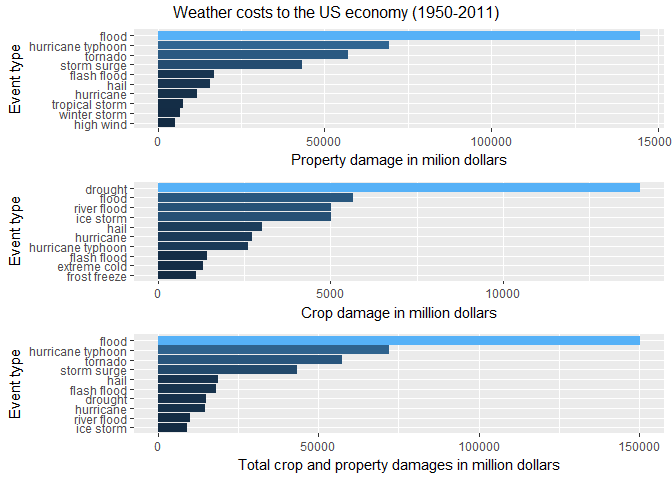

# Storm Data Analysis

# Health and Economic Impact of Storms and Other Weather Events in the United States
Storms and other severe weather events can cause both public health and economic problems for communities and municipalities. Many severe events can result in fatalities, injuries, and property damage, and preventing such outcomes to the extent possible is a key concern.

This project involves exploring the U.S. National Oceanic and Atmospheric Administration's (NOAA) storm database. This database tracks characteristics of major storms and weather events in the United States, including when and where they occur, as well as estimates of any fatalities, injuries, and property damage.

Using the NOAA storm database, we aim to answer the following questions:
1. Which type of events are most harmful with respect to population health?
2. Which type of events have the greatest economic consequences?

# Synopsis
The analysis on the storm event database revealed that tornadoes are the most dangerous weather event to the population health causing both death and injury. The next most dangerous event types causing death are excessive heat and flash floods and 

The economic impact of weather events was also analyzed. Floods and hurricanes caused billions of dollars in property damages between 1950 and 2011. The largest crop damage is caused by drought, followed by flood. Overall, flood cost the US economy around $15 billion due to damage to property and crops.

# Data
The data comes from the U.S. National Oceanic and Atmospheric Administration's (NOAA) and is in form of a comma-separated-value file compressed via the bzip2 algorithm to reduce its size. 

- [Storm Data](https://d396qusza40orc.cloudfront.net/repdata%2Fdata%2FStormData.csv.bz2)

Documentation of the database is available and describes how some of the variables are constructed/defined.

- [National Weather Service Storm Data Documentation](https://d396qusza40orc.cloudfront.net/repdata%2Fpeer2_doc%2Fpd01016005curr.pdf)
- [National Climatic Data Center Storm Events FAQ](https://d396qusza40orc.cloudfront.net/repdata%2Fpeer2_doc%2FNCDC%20Storm%20Events-FAQ%20Page.pdf)

The events in the database start in the year 1950 and end in November 2011. In the earlier years of the database there are generally fewer events recorded, most likely due to a lack of good records. More recent years should be considered more complete.

# Data Processing
Data processing includes the following steps:

1. Setting up the R environment, i.e., load the required libraries and pre-set R
2. Download the data file from https://d396qusza40orc.cloudfront.net/repdata%2Fdata%2FStormData.csv.bz2 and read into a data frame
3. Data cleansing and preparation

## Set up the R Environment


## Download the file and read into a data frame

```r
# Download the data from https://d396qusza40orc.cloudfront.net/repdata%2Fdata%2FStormData.csv.bz2
url <- "https://d396qusza40orc.cloudfront.net/repdata%2Fdata%2FStormData.csv.bz2"
targetFileName <- "StormData.csv.bz2"
  
# Download only if the zip file hasn't been dowloaded yet.
if (!file.exists(targetFileName)) {
  download.file(url, targetFileName)  
}
  
# read.csv is smart enough to detect that the file is in bzip2 format and will automatically 
#  uncompress the file and read it in.
stormData <- read.csv(targetFileName)
```
## Data Analysis and Cleansing

Based on the requirement:
1.  find the event types that are most harmful to population health
2.  find the event types that cause the most economic consequences

the required columns from the storm data are:
1.  EVTYPE - event type
2.  FATALITIES - the number of fatalities
3.  INJURIES - the number of injuries
4.  PROPDMG - monetary amount of property damage 
5.  PROPDMGEXP - quantifier for the property damage, i.e., is the amount in hundreds, thousands, millions.
6.  CROPDMG - monetary amount of crop damage
7.  CROPDMGEXP - quantifier for the crop damage, i.e., is the amount in hundreds, thousands, millions.

Let's look into the above columns 

### EVTTPE column 

```r
# Grab the unique values of the EVTYPE column and sort we can investigate better the data.
print("Unique unadultered event types:")
```

```
## [1] "Unique unadultered event types:"
```

```r
unique(stormData$EVTYPE) %>% sort()
```

```
##   [1]    HIGH SURF ADVISORY           COASTAL FLOOD                
##   [3]  FLASH FLOOD                    LIGHTNING                    
##   [5]  TSTM WIND                      TSTM WIND (G45)              
##   [7]  WATERSPOUT                     WIND                         
##   [9] ?                              ABNORMAL WARMTH               
##  [11] ABNORMALLY DRY                 ABNORMALLY WET                
##  [13] ACCUMULATED SNOWFALL           AGRICULTURAL FREEZE           
##  [15] APACHE COUNTY                  ASTRONOMICAL HIGH TIDE        
##  [17] ASTRONOMICAL LOW TIDE          AVALANCE                      
##  [19] AVALANCHE                      BEACH EROSIN                  
##  [21] Beach Erosion                  BEACH EROSION                 
##  [23] BEACH EROSION/COASTAL FLOOD    BEACH FLOOD                   
##  [25] BELOW NORMAL PRECIPITATION     BITTER WIND CHILL             
##  [27] BITTER WIND CHILL TEMPERATURES Black Ice                     
##  [29] BLACK ICE                      BLIZZARD                      
##  [31] BLIZZARD AND EXTREME WIND CHIL BLIZZARD AND HEAVY SNOW       
##  [33] Blizzard Summary               BLIZZARD WEATHER              
##  [35] BLIZZARD/FREEZING RAIN         BLIZZARD/HEAVY SNOW           
##  [37] BLIZZARD/HIGH WIND             BLIZZARD/WINTER STORM         
##  [39] BLOW-OUT TIDE                  BLOW-OUT TIDES                
##  [41] BLOWING DUST                   blowing snow                  
##  [43] Blowing Snow                   BLOWING SNOW                  
##  [45] BLOWING SNOW- EXTREME WIND CHI BLOWING SNOW & EXTREME WIND CH
##  [47] BLOWING SNOW/EXTREME WIND CHIL BREAKUP FLOODING              
##  [49] BRUSH FIRE                     BRUSH FIRES                   
##  [51] COASTAL  FLOODING/EROSION      COASTAL EROSION               
##  [53] Coastal Flood                  COASTAL FLOOD                 
##  [55] coastal flooding               Coastal Flooding              
##  [57] COASTAL FLOODING               COASTAL FLOODING/EROSION      
##  [59] Coastal Storm                  COASTAL STORM                 
##  [61] COASTAL SURGE                  COASTAL/TIDAL FLOOD           
##  [63] COASTALFLOOD                   COASTALSTORM                  
##  [65] Cold                           COLD                          
##  [67] COLD AIR FUNNEL                COLD AIR FUNNELS              
##  [69] COLD AIR TORNADO               Cold and Frost                
##  [71] COLD AND FROST                 COLD AND SNOW                 
##  [73] COLD AND WET CONDITIONS        Cold Temperature              
##  [75] COLD TEMPERATURES              COLD WAVE                     
##  [77] COLD WEATHER                   COLD WIND CHILL TEMPERATURES  
##  [79] COLD/WIND CHILL                COLD/WINDS                    
##  [81] COOL AND WET                   COOL SPELL                    
##  [83] CSTL FLOODING/EROSION          DAM BREAK                     
##  [85] DAM FAILURE                    Damaging Freeze               
##  [87] DAMAGING FREEZE                DEEP HAIL                     
##  [89] DENSE FOG                      DENSE SMOKE                   
##  [91] DOWNBURST                      DOWNBURST WINDS               
##  [93] DRIEST MONTH                   Drifting Snow                 
##  [95] DROUGHT                        DROUGHT/EXCESSIVE HEAT        
##  [97] DROWNING                       DRY                           
##  [99] DRY CONDITIONS                 DRY HOT WEATHER               
## [101] DRY MICROBURST                 DRY MICROBURST 50             
## [103] DRY MICROBURST 53              DRY MICROBURST 58             
## [105] DRY MICROBURST 61              DRY MICROBURST 84             
## [107] DRY MICROBURST WINDS           DRY MIRCOBURST WINDS          
## [109] DRY PATTERN                    DRY SPELL                     
## [111] DRY WEATHER                    DRYNESS                       
## [113] DUST DEVEL                     Dust Devil                    
## [115] DUST DEVIL                     DUST DEVIL WATERSPOUT         
## [117] DUST STORM                     DUST STORM/HIGH WINDS         
## [119] DUSTSTORM                      EARLY FREEZE                  
## [121] Early Frost                    EARLY FROST                   
## [123] EARLY RAIN                     EARLY SNOW                    
## [125] Early snowfall                 EARLY SNOWFALL                
## [127] Erosion/Cstl Flood             EXCESSIVE                     
## [129] Excessive Cold                 EXCESSIVE HEAT                
## [131] EXCESSIVE HEAT/DROUGHT         EXCESSIVE PRECIPITATION       
## [133] EXCESSIVE RAIN                 EXCESSIVE RAINFALL            
## [135] EXCESSIVE SNOW                 EXCESSIVE WETNESS             
## [137] EXCESSIVELY DRY                Extended Cold                 
## [139] Extreme Cold                   EXTREME COLD                  
## [141] EXTREME COLD/WIND CHILL        EXTREME HEAT                  
## [143] EXTREME WIND CHILL             EXTREME WIND CHILL/BLOWING SNO
## [145] EXTREME WIND CHILLS            EXTREME WINDCHILL             
## [147] EXTREME WINDCHILL TEMPERATURES EXTREME/RECORD COLD           
## [149] EXTREMELY WET                  FALLING SNOW/ICE              
## [151] FIRST FROST                    FIRST SNOW                    
## [153] FLASH FLOOD                    FLASH FLOOD - HEAVY RAIN      
## [155] FLASH FLOOD FROM ICE JAMS      FLASH FLOOD LANDSLIDES        
## [157] FLASH FLOOD WINDS              FLASH FLOOD/                  
## [159] FLASH FLOOD/ FLOOD             FLASH FLOOD/ STREET           
## [161] FLASH FLOOD/FLOOD              FLASH FLOOD/HEAVY RAIN        
## [163] FLASH FLOOD/LANDSLIDE          FLASH FLOODING                
## [165] FLASH FLOODING/FLOOD           FLASH FLOODING/THUNDERSTORM WI
## [167] FLASH FLOODS                   FLASH FLOOODING               
## [169] Flood                          FLOOD                         
## [171] FLOOD & HEAVY RAIN             FLOOD FLASH                   
## [173] FLOOD FLOOD/FLASH              FLOOD WATCH/                  
## [175] FLOOD/FLASH                    Flood/Flash Flood             
## [177] FLOOD/FLASH FLOOD              FLOOD/FLASH FLOODING          
## [179] FLOOD/FLASH/FLOOD              FLOOD/FLASHFLOOD              
## [181] FLOOD/RAIN/WIND                FLOOD/RAIN/WINDS              
## [183] FLOOD/RIVER FLOOD              Flood/Strong Wind             
## [185] FLOODING                       FLOODING/HEAVY RAIN           
## [187] FLOODS                         FOG                           
## [189] FOG AND COLD TEMPERATURES      FOREST FIRES                  
## [191] Freeze                         FREEZE                        
## [193] Freezing drizzle               Freezing Drizzle              
## [195] FREEZING DRIZZLE               FREEZING DRIZZLE AND FREEZING 
## [197] Freezing Fog                   FREEZING FOG                  
## [199] Freezing rain                  Freezing Rain                 
## [201] FREEZING RAIN                  FREEZING RAIN AND SLEET       
## [203] FREEZING RAIN AND SNOW         FREEZING RAIN SLEET AND       
## [205] FREEZING RAIN SLEET AND LIGHT  FREEZING RAIN/SLEET           
## [207] FREEZING RAIN/SNOW             Freezing Spray                
## [209] Frost                          FROST                         
## [211] Frost/Freeze                   FROST/FREEZE                  
## [213] FROST\\FREEZE                  FUNNEL                        
## [215] Funnel Cloud                   FUNNEL CLOUD                  
## [217] FUNNEL CLOUD.                  FUNNEL CLOUD/HAIL             
## [219] FUNNEL CLOUDS                  FUNNELS                       
## [221] Glaze                          GLAZE                         
## [223] GLAZE ICE                      GLAZE/ICE STORM               
## [225] gradient wind                  Gradient wind                 
## [227] GRADIENT WIND                  GRADIENT WINDS                
## [229] GRASS FIRES                    GROUND BLIZZARD               
## [231] GUSTNADO                       GUSTNADO AND                  
## [233] GUSTY LAKE WIND                GUSTY THUNDERSTORM WIND       
## [235] GUSTY THUNDERSTORM WINDS       Gusty Wind                    
## [237] GUSTY WIND                     GUSTY WIND/HAIL               
## [239] GUSTY WIND/HVY RAIN            Gusty wind/rain               
## [241] Gusty winds                    Gusty Winds                   
## [243] GUSTY WINDS                    HAIL                          
## [245] HAIL 0.75                      HAIL 0.88                     
## [247] HAIL 075                       HAIL 088                      
## [249] HAIL 1.00                      HAIL 1.75                     
## [251] HAIL 1.75)                     HAIL 100                      
## [253] HAIL 125                       HAIL 150                      
## [255] HAIL 175                       HAIL 200                      
## [257] HAIL 225                       HAIL 275                      
## [259] HAIL 450                       HAIL 75                       
## [261] HAIL 80                        HAIL 88                       
## [263] HAIL ALOFT                     HAIL DAMAGE                   
## [265] HAIL FLOODING                  HAIL STORM                    
## [267] Hail(0.75)                     HAIL/ICY ROADS                
## [269] HAIL/WIND                      HAIL/WINDS                    
## [271] HAILSTORM                      HAILSTORMS                    
## [273] HARD FREEZE                    HAZARDOUS SURF                
## [275] HEAT                           HEAT DROUGHT                  
## [277] Heat Wave                      HEAT WAVE                     
## [279] HEAT WAVE DROUGHT              HEAT WAVES                    
## [281] HEAT/DROUGHT                   Heatburst                     
## [283] HEAVY LAKE SNOW                HEAVY MIX                     
## [285] HEAVY PRECIPATATION            Heavy Precipitation           
## [287] HEAVY PRECIPITATION            Heavy rain                    
## [289] Heavy Rain                     HEAVY RAIN                    
## [291] HEAVY RAIN AND FLOOD           Heavy Rain and Wind           
## [293] HEAVY RAIN EFFECTS             HEAVY RAIN/FLOODING           
## [295] Heavy Rain/High Surf           HEAVY RAIN/LIGHTNING          
## [297] HEAVY RAIN/MUDSLIDES/FLOOD     HEAVY RAIN/SEVERE WEATHER     
## [299] HEAVY RAIN/SMALL STREAM URBAN  HEAVY RAIN/SNOW               
## [301] HEAVY RAIN/URBAN FLOOD         HEAVY RAIN/WIND               
## [303] HEAVY RAIN; URBAN FLOOD WINDS; HEAVY RAINFALL                
## [305] HEAVY RAINS                    HEAVY RAINS/FLOODING          
## [307] HEAVY SEAS                     HEAVY SHOWER                  
## [309] HEAVY SHOWERS                  HEAVY SNOW                    
## [311] HEAVY SNOW-SQUALLS             HEAVY SNOW   FREEZING RAIN    
## [313] HEAVY SNOW & ICE               HEAVY SNOW AND                
## [315] HEAVY SNOW AND HIGH WINDS      HEAVY SNOW AND ICE            
## [317] HEAVY SNOW AND ICE STORM       HEAVY SNOW AND STRONG WINDS   
## [319] HEAVY SNOW ANDBLOWING SNOW     Heavy snow shower             
## [321] HEAVY SNOW SQUALLS             HEAVY SNOW/BLIZZARD           
## [323] HEAVY SNOW/BLIZZARD/AVALANCHE  HEAVY SNOW/BLOWING SNOW       
## [325] HEAVY SNOW/FREEZING RAIN       HEAVY SNOW/HIGH               
## [327] HEAVY SNOW/HIGH WIND           HEAVY SNOW/HIGH WINDS         
## [329] HEAVY SNOW/HIGH WINDS & FLOOD  HEAVY SNOW/HIGH WINDS/FREEZING
## [331] HEAVY SNOW/ICE                 HEAVY SNOW/ICE STORM          
## [333] HEAVY SNOW/SLEET               HEAVY SNOW/SQUALLS            
## [335] HEAVY SNOW/WIND                HEAVY SNOW/WINTER STORM       
## [337] HEAVY SNOWPACK                 Heavy Surf                    
## [339] HEAVY SURF                     Heavy surf and wind           
## [341] HEAVY SURF COASTAL FLOODING    HEAVY SURF/HIGH SURF          
## [343] HEAVY SWELLS                   HEAVY WET SNOW                
## [345] HIGH                           HIGH  SWELLS                  
## [347] HIGH  WINDS                    HIGH SEAS                     
## [349] High Surf                      HIGH SURF                     
## [351] HIGH SURF ADVISORIES           HIGH SURF ADVISORY            
## [353] HIGH SWELLS                    HIGH TEMPERATURE RECORD       
## [355] HIGH TIDES                     HIGH WATER                    
## [357] HIGH WAVES                     High Wind                     
## [359] HIGH WIND                      HIGH WIND (G40)               
## [361] HIGH WIND 48                   HIGH WIND 63                  
## [363] HIGH WIND 70                   HIGH WIND AND HEAVY SNOW      
## [365] HIGH WIND AND HIGH TIDES       HIGH WIND AND SEAS            
## [367] HIGH WIND DAMAGE               HIGH WIND/ BLIZZARD           
## [369] HIGH WIND/BLIZZARD             HIGH WIND/BLIZZARD/FREEZING RA
## [371] HIGH WIND/HEAVY SNOW           HIGH WIND/LOW WIND CHILL      
## [373] HIGH WIND/SEAS                 HIGH WIND/WIND CHILL          
## [375] HIGH WIND/WIND CHILL/BLIZZARD  HIGH WINDS                    
## [377] HIGH WINDS 55                  HIGH WINDS 57                 
## [379] HIGH WINDS 58                  HIGH WINDS 63                 
## [381] HIGH WINDS 66                  HIGH WINDS 67                 
## [383] HIGH WINDS 73                  HIGH WINDS 76                 
## [385] HIGH WINDS 80                  HIGH WINDS 82                 
## [387] HIGH WINDS AND WIND CHILL      HIGH WINDS DUST STORM         
## [389] HIGH WINDS HEAVY RAINS         HIGH WINDS/                   
## [391] HIGH WINDS/COASTAL FLOOD       HIGH WINDS/COLD               
## [393] HIGH WINDS/FLOODING            HIGH WINDS/HEAVY RAIN         
## [395] HIGH WINDS/SNOW                HIGHWAY FLOODING              
## [397] Hot and Dry                    HOT PATTERN                   
## [399] HOT SPELL                      HOT WEATHER                   
## [401] HOT/DRY PATTERN                HURRICANE                     
## [403] HURRICANE-GENERATED SWELLS     Hurricane Edouard             
## [405] HURRICANE EMILY                HURRICANE ERIN                
## [407] HURRICANE FELIX                HURRICANE GORDON              
## [409] HURRICANE OPAL                 HURRICANE OPAL/HIGH WINDS     
## [411] HURRICANE/TYPHOON              HVY RAIN                      
## [413] HYPERTHERMIA/EXPOSURE          HYPOTHERMIA                   
## [415] Hypothermia/Exposure           HYPOTHERMIA/EXPOSURE          
## [417] ICE                            ICE AND SNOW                  
## [419] ICE FLOES                      Ice Fog                       
## [421] ICE JAM                        Ice jam flood (minor          
## [423] ICE JAM FLOODING               ICE ON ROAD                   
## [425] ICE PELLETS                    ICE ROADS                     
## [427] ICE STORM                      ICE STORM AND SNOW            
## [429] ICE STORM/FLASH FLOOD          Ice/Snow                      
## [431] ICE/SNOW                       ICE/STRONG WINDS              
## [433] Icestorm/Blizzard              Icy Roads                     
## [435] ICY ROADS                      LACK OF SNOW                  
## [437] LAKE-EFFECT SNOW               Lake Effect Snow              
## [439] LAKE EFFECT SNOW               LAKE FLOOD                    
## [441] LAKESHORE FLOOD                LANDSLIDE                     
## [443] LANDSLIDE/URBAN FLOOD          LANDSLIDES                    
## [445] Landslump                      LANDSLUMP                     
## [447] LANDSPOUT                      LARGE WALL CLOUD              
## [449] Late-season Snowfall           LATE FREEZE                   
## [451] LATE SEASON HAIL               LATE SEASON SNOW              
## [453] Late Season Snowfall           LATE SNOW                     
## [455] LIGHT FREEZING RAIN            Light snow                    
## [457] Light Snow                     LIGHT SNOW                    
## [459] LIGHT SNOW AND SLEET           Light Snow/Flurries           
## [461] LIGHT SNOW/FREEZING PRECIP     Light Snowfall                
## [463] LIGHTING                       LIGHTNING                     
## [465] LIGHTNING  WAUSEON             LIGHTNING AND HEAVY RAIN      
## [467] LIGHTNING AND THUNDERSTORM WIN LIGHTNING AND WINDS           
## [469] LIGHTNING DAMAGE               LIGHTNING FIRE                
## [471] LIGHTNING INJURY               LIGHTNING THUNDERSTORM WINDS  
## [473] LIGHTNING THUNDERSTORM WINDSS  LIGHTNING.                    
## [475] LIGHTNING/HEAVY RAIN           LIGNTNING                     
## [477] LOCAL FLASH FLOOD              LOCAL FLOOD                   
## [479] LOCALLY HEAVY RAIN             LOW TEMPERATURE               
## [481] LOW TEMPERATURE RECORD         LOW WIND CHILL                
## [483] MAJOR FLOOD                    Marine Accident               
## [485] MARINE HAIL                    MARINE HIGH WIND              
## [487] MARINE MISHAP                  MARINE STRONG WIND            
## [489] MARINE THUNDERSTORM WIND       MARINE TSTM WIND              
## [491] Metro Storm, May 26            Microburst                    
## [493] MICROBURST                     MICROBURST WINDS              
## [495] Mild and Dry Pattern           MILD PATTERN                  
## [497] MILD/DRY PATTERN               MINOR FLOOD                   
## [499] Minor Flooding                 MINOR FLOODING                
## [501] MIXED PRECIP                   Mixed Precipitation           
## [503] MIXED PRECIPITATION            MODERATE SNOW                 
## [505] MODERATE SNOWFALL              MONTHLY PRECIPITATION         
## [507] Monthly Rainfall               MONTHLY RAINFALL              
## [509] Monthly Snowfall               MONTHLY SNOWFALL              
## [511] MONTHLY TEMPERATURE            Mountain Snows                
## [513] MUD SLIDE                      MUD SLIDES                    
## [515] MUD SLIDES URBAN FLOODING      MUD/ROCK SLIDE                
## [517] Mudslide                       MUDSLIDE                      
## [519] MUDSLIDE/LANDSLIDE             Mudslides                     
## [521] MUDSLIDES                      NEAR RECORD SNOW              
## [523] No Severe Weather              NON-SEVERE WIND DAMAGE        
## [525] NON-TSTM WIND                  NON SEVERE HAIL               
## [527] NON TSTM WIND                  NONE                          
## [529] NORMAL PRECIPITATION           NORTHERN LIGHTS               
## [531] Other                          OTHER                         
## [533] PATCHY DENSE FOG               PATCHY ICE                    
## [535] Prolong Cold                   PROLONG COLD                  
## [537] PROLONG COLD/SNOW              PROLONG WARMTH                
## [539] PROLONGED RAIN                 RAIN                          
## [541] RAIN (HEAVY)                   RAIN AND WIND                 
## [543] Rain Damage                    RAIN/SNOW                     
## [545] RAIN/WIND                      RAINSTORM                     
## [547] RAPIDLY RISING WATER           RECORD  COLD                  
## [549] Record Cold                    RECORD COLD                   
## [551] RECORD COLD AND HIGH WIND      RECORD COLD/FROST             
## [553] RECORD COOL                    Record dry month              
## [555] RECORD DRYNESS                 Record Heat                   
## [557] RECORD HEAT                    RECORD HEAT WAVE              
## [559] Record High                    RECORD HIGH                   
## [561] RECORD HIGH TEMPERATURE        RECORD HIGH TEMPERATURES      
## [563] RECORD LOW                     RECORD LOW RAINFALL           
## [565] Record May Snow                RECORD PRECIPITATION          
## [567] RECORD RAINFALL                RECORD SNOW                   
## [569] RECORD SNOW/COLD               RECORD SNOWFALL               
## [571] Record temperature             RECORD TEMPERATURE            
## [573] Record Temperatures            RECORD TEMPERATURES           
## [575] RECORD WARM                    RECORD WARM TEMPS.            
## [577] Record Warmth                  RECORD WARMTH                 
## [579] Record Winter Snow             RECORD/EXCESSIVE HEAT         
## [581] RECORD/EXCESSIVE RAINFALL      RED FLAG CRITERIA             
## [583] RED FLAG FIRE WX               REMNANTS OF FLOYD             
## [585] RIP CURRENT                    RIP CURRENTS                  
## [587] RIP CURRENTS HEAVY SURF        RIP CURRENTS/HEAVY SURF       
## [589] RIVER AND STREAM FLOOD         RIVER FLOOD                   
## [591] River Flooding                 RIVER FLOODING                
## [593] ROCK SLIDE                     ROGUE WAVE                    
## [595] ROTATING WALL CLOUD            ROUGH SEAS                    
## [597] ROUGH SURF                     RURAL FLOOD                   
## [599] Saharan Dust                   SAHARAN DUST                  
## [601] Seasonal Snowfall              SEICHE                        
## [603] SEVERE COLD                    SEVERE THUNDERSTORM           
## [605] SEVERE THUNDERSTORM WINDS      SEVERE THUNDERSTORMS          
## [607] SEVERE TURBULENCE              SLEET                         
## [609] SLEET & FREEZING RAIN          SLEET STORM                   
## [611] SLEET/FREEZING RAIN            SLEET/ICE STORM               
## [613] SLEET/RAIN/SNOW                SLEET/SNOW                    
## [615] small hail                     Small Hail                    
## [617] SMALL HAIL                     SMALL STREAM                  
## [619] SMALL STREAM AND               SMALL STREAM AND URBAN FLOOD  
## [621] SMALL STREAM AND URBAN FLOODIN SMALL STREAM FLOOD            
## [623] SMALL STREAM FLOODING          SMALL STREAM URBAN FLOOD      
## [625] SMALL STREAM/URBAN FLOOD       Sml Stream Fld                
## [627] SMOKE                          Snow                          
## [629] SNOW                           SNOW- HIGH WIND- WIND CHILL   
## [631] Snow Accumulation              SNOW ACCUMULATION             
## [633] SNOW ADVISORY                  SNOW AND COLD                 
## [635] SNOW AND HEAVY SNOW            Snow and Ice                  
## [637] SNOW AND ICE                   SNOW AND ICE STORM            
## [639] Snow and sleet                 SNOW AND SLEET                
## [641] SNOW AND WIND                  SNOW DROUGHT                  
## [643] SNOW FREEZING RAIN             SNOW SHOWERS                  
## [645] SNOW SLEET                     SNOW SQUALL                   
## [647] Snow squalls                   Snow Squalls                  
## [649] SNOW SQUALLS                   SNOW/ BITTER COLD             
## [651] SNOW/ ICE                      SNOW/BLOWING SNOW             
## [653] SNOW/COLD                      SNOW/FREEZING RAIN            
## [655] SNOW/HEAVY SNOW                SNOW/HIGH WINDS               
## [657] SNOW/ICE                       SNOW/ICE STORM                
## [659] SNOW/RAIN                      SNOW/RAIN/SLEET               
## [661] SNOW/SLEET                     SNOW/SLEET/FREEZING RAIN      
## [663] SNOW/SLEET/RAIN                SNOW\\COLD                    
## [665] SNOWFALL RECORD                SNOWMELT FLOODING             
## [667] SNOWSTORM                      SOUTHEAST                     
## [669] STORM FORCE WINDS              STORM SURGE                   
## [671] STORM SURGE/TIDE               STREAM FLOODING               
## [673] STREET FLOOD                   STREET FLOODING               
## [675] Strong Wind                    STRONG WIND                   
## [677] STRONG WIND GUST               Strong winds                  
## [679] Strong Winds                   STRONG WINDS                  
## [681] Summary August 10              Summary August 11             
## [683] Summary August 17              Summary August 2-3            
## [685] Summary August 21              Summary August 28             
## [687] Summary August 4               Summary August 7              
## [689] Summary August 9               Summary Jan 17                
## [691] Summary July 23-24             Summary June 18-19            
## [693] Summary June 5-6               Summary June 6                
## [695] Summary of April 12            Summary of April 13           
## [697] Summary of April 21            Summary of April 27           
## [699] Summary of April 3rd           Summary of August 1           
## [701] Summary of July 11             Summary of July 2             
## [703] Summary of July 22             Summary of July 26            
## [705] Summary of July 29             Summary of July 3             
## [707] Summary of June 10             Summary of June 11            
## [709] Summary of June 12             Summary of June 13            
## [711] Summary of June 15             Summary of June 16            
## [713] Summary of June 18             Summary of June 23            
## [715] Summary of June 24             Summary of June 3             
## [717] Summary of June 30             Summary of June 4             
## [719] Summary of June 6              Summary of March 14           
## [721] Summary of March 23            Summary of March 24           
## [723] SUMMARY OF MARCH 24-25         SUMMARY OF MARCH 27           
## [725] SUMMARY OF MARCH 29            Summary of May 10             
## [727] Summary of May 13              Summary of May 14             
## [729] Summary of May 22              Summary of May 22 am          
## [731] Summary of May 22 pm           Summary of May 26 am          
## [733] Summary of May 26 pm           Summary of May 31 am          
## [735] Summary of May 31 pm           Summary of May 9-10           
## [737] Summary Sept. 25-26            Summary September 20          
## [739] Summary September 23           Summary September 3           
## [741] Summary September 4            Summary: Nov. 16              
## [743] Summary: Nov. 6-7              Summary: Oct. 20-21           
## [745] Summary: October 31            Summary: Sept. 18             
## [747] Temperature record             THUDERSTORM WINDS             
## [749] THUNDEERSTORM WINDS            THUNDERESTORM WINDS           
## [751] THUNDERSNOW                    Thundersnow shower            
## [753] THUNDERSTORM                   THUNDERSTORM  WINDS           
## [755] THUNDERSTORM DAMAGE            THUNDERSTORM DAMAGE TO        
## [757] THUNDERSTORM HAIL              THUNDERSTORM W INDS           
## [759] Thunderstorm Wind              THUNDERSTORM WIND             
## [761] THUNDERSTORM WIND (G40)        THUNDERSTORM WIND 50          
## [763] THUNDERSTORM WIND 52           THUNDERSTORM WIND 56          
## [765] THUNDERSTORM WIND 59           THUNDERSTORM WIND 59 MPH      
## [767] THUNDERSTORM WIND 59 MPH.      THUNDERSTORM WIND 60 MPH      
## [769] THUNDERSTORM WIND 65 MPH       THUNDERSTORM WIND 65MPH       
## [771] THUNDERSTORM WIND 69           THUNDERSTORM WIND 98 MPH      
## [773] THUNDERSTORM WIND G50          THUNDERSTORM WIND G51         
## [775] THUNDERSTORM WIND G52          THUNDERSTORM WIND G55         
## [777] THUNDERSTORM WIND G60          THUNDERSTORM WIND G61         
## [779] THUNDERSTORM WIND TREES        THUNDERSTORM WIND.            
## [781] THUNDERSTORM WIND/ TREE        THUNDERSTORM WIND/ TREES      
## [783] THUNDERSTORM WIND/AWNING       THUNDERSTORM WIND/HAIL        
## [785] THUNDERSTORM WIND/LIGHTNING    THUNDERSTORM WINDS            
## [787] THUNDERSTORM WINDS      LE CEN THUNDERSTORM WINDS 13         
## [789] THUNDERSTORM WINDS 2           THUNDERSTORM WINDS 50         
## [791] THUNDERSTORM WINDS 52          THUNDERSTORM WINDS 53         
## [793] THUNDERSTORM WINDS 60          THUNDERSTORM WINDS 61         
## [795] THUNDERSTORM WINDS 62          THUNDERSTORM WINDS 63 MPH     
## [797] THUNDERSTORM WINDS AND         THUNDERSTORM WINDS FUNNEL CLOU
## [799] THUNDERSTORM WINDS G           THUNDERSTORM WINDS G60        
## [801] THUNDERSTORM WINDS HAIL        THUNDERSTORM WINDS HEAVY RAIN 
## [803] THUNDERSTORM WINDS LIGHTNING   THUNDERSTORM WINDS SMALL STREA
## [805] THUNDERSTORM WINDS URBAN FLOOD THUNDERSTORM WINDS.           
## [807] THUNDERSTORM WINDS/ FLOOD      THUNDERSTORM WINDS/ HAIL      
## [809] THUNDERSTORM WINDS/FLASH FLOOD THUNDERSTORM WINDS/FLOODING   
## [811] THUNDERSTORM WINDS/FUNNEL CLOU THUNDERSTORM WINDS/HAIL       
## [813] THUNDERSTORM WINDS/HEAVY RAIN  THUNDERSTORM WINDS53          
## [815] THUNDERSTORM WINDSHAIL         THUNDERSTORM WINDSS           
## [817] THUNDERSTORM WINS              THUNDERSTORMS                 
## [819] THUNDERSTORMS WIND             THUNDERSTORMS WINDS           
## [821] THUNDERSTORMW                  THUNDERSTORMW 50              
## [823] THUNDERSTORMW WINDS            THUNDERSTORMWINDS             
## [825] THUNDERSTROM WIND              THUNDERSTROM WINDS            
## [827] THUNDERTORM WINDS              THUNDERTSORM WIND             
## [829] THUNDESTORM WINDS              THUNERSTORM WINDS             
## [831] TIDAL FLOOD                    Tidal Flooding                
## [833] TIDAL FLOODING                 TORNADO                       
## [835] TORNADO DEBRIS                 TORNADO F0                    
## [837] TORNADO F1                     TORNADO F2                    
## [839] TORNADO F3                     TORNADO/WATERSPOUT            
## [841] TORNADOES                      TORNADOES, TSTM WIND, HAIL    
## [843] TORNADOS                       TORNDAO                       
## [845] TORRENTIAL RAIN                Torrential Rainfall           
## [847] TROPICAL DEPRESSION            TROPICAL STORM                
## [849] TROPICAL STORM ALBERTO         TROPICAL STORM DEAN           
## [851] TROPICAL STORM GORDON          TROPICAL STORM JERRY          
## [853] TSTM                           TSTM HEAVY RAIN               
## [855] Tstm Wind                      TSTM WIND                     
## [857] TSTM WIND  (G45)               TSTM WIND (41)                
## [859] TSTM WIND (G35)                TSTM WIND (G40)               
## [861] TSTM WIND (G45)                TSTM WIND 40                  
## [863] TSTM WIND 45                   TSTM WIND 50                  
## [865] TSTM WIND 51                   TSTM WIND 52                  
## [867] TSTM WIND 55                   TSTM WIND 65)                 
## [869] TSTM WIND AND LIGHTNING        TSTM WIND DAMAGE              
## [871] TSTM WIND G45                  TSTM WIND G58                 
## [873] TSTM WIND/HAIL                 TSTM WINDS                    
## [875] TSTM WND                       TSTMW                         
## [877] TSUNAMI                        TUNDERSTORM WIND              
## [879] TYPHOON                        Unseasonable Cold             
## [881] UNSEASONABLY COLD              UNSEASONABLY COOL             
## [883] UNSEASONABLY COOL & WET        UNSEASONABLY DRY              
## [885] UNSEASONABLY HOT               UNSEASONABLY WARM             
## [887] UNSEASONABLY WARM & WET        UNSEASONABLY WARM AND DRY     
## [889] UNSEASONABLY WARM YEAR         UNSEASONABLY WARM/WET         
## [891] UNSEASONABLY WET               UNSEASONAL LOW TEMP           
## [893] UNSEASONAL RAIN                UNUSUAL WARMTH                
## [895] UNUSUAL/RECORD WARMTH          UNUSUALLY COLD                
## [897] UNUSUALLY LATE SNOW            UNUSUALLY WARM                
## [899] URBAN AND SMALL                URBAN AND SMALL STREAM        
## [901] URBAN AND SMALL STREAM FLOOD   URBAN AND SMALL STREAM FLOODIN
## [903] Urban flood                    Urban Flood                   
## [905] URBAN FLOOD                    URBAN FLOOD LANDSLIDE         
## [907] Urban Flooding                 URBAN FLOODING                
## [909] URBAN FLOODS                   URBAN SMALL                   
## [911] URBAN SMALL STREAM FLOOD       URBAN/SMALL                   
## [913] URBAN/SMALL FLOODING           URBAN/SMALL STREAM            
## [915] URBAN/SMALL STREAM  FLOOD      URBAN/SMALL STREAM FLOOD      
## [917] URBAN/SMALL STREAM FLOODING    URBAN/SMALL STRM FLDG         
## [919] URBAN/SML STREAM FLD           URBAN/SML STREAM FLDG         
## [921] URBAN/STREET FLOODING          VERY DRY                      
## [923] VERY WARM                      VOG                           
## [925] Volcanic Ash                   VOLCANIC ASH                  
## [927] Volcanic Ash Plume             VOLCANIC ASHFALL              
## [929] VOLCANIC ERUPTION              WAKE LOW WIND                 
## [931] WALL CLOUD                     WALL CLOUD/FUNNEL CLOUD       
## [933] WARM DRY CONDITIONS            WARM WEATHER                  
## [935] WATER SPOUT                    WATERSPOUT                    
## [937] WATERSPOUT-                    WATERSPOUT-TORNADO            
## [939] WATERSPOUT FUNNEL CLOUD        WATERSPOUT TORNADO            
## [941] WATERSPOUT/                    WATERSPOUT/ TORNADO           
## [943] WATERSPOUT/TORNADO             WATERSPOUTS                   
## [945] WAYTERSPOUT                    wet micoburst                 
## [947] WET MICROBURST                 Wet Month                     
## [949] WET SNOW                       WET WEATHER                   
## [951] Wet Year                       Whirlwind                     
## [953] WHIRLWIND                      WILD FIRES                    
## [955] WILD/FOREST FIRE               WILD/FOREST FIRES             
## [957] WILDFIRE                       WILDFIRES                     
## [959] Wind                           WIND                          
## [961] WIND ADVISORY                  WIND AND WAVE                 
## [963] WIND CHILL                     WIND CHILL/HIGH WIND          
## [965] Wind Damage                    WIND DAMAGE                   
## [967] WIND GUSTS                     WIND STORM                    
## [969] WIND/HAIL                      WINDS                         
## [971] WINTER MIX                     WINTER STORM                  
## [973] WINTER STORM HIGH WINDS        WINTER STORM/HIGH WIND        
## [975] WINTER STORM/HIGH WINDS        WINTER STORMS                 
## [977] Winter Weather                 WINTER WEATHER                
## [979] WINTER WEATHER MIX             WINTER WEATHER/MIX            
## [981] WINTERY MIX                    Wintry mix                    
## [983] Wintry Mix                     WINTRY MIX                    
## [985] WND                           
## 985 Levels:    HIGH SURF ADVISORY  COASTAL FLOOD ... WND
```
The event type column has 985 levels.  Here's a preliminary analyis of the data which would determine our approach to cleanse the EVTYPE column
1. There are trailing spaces
2.  There are mixed cases like "Strong Wind" and "STRONG WIND" which are the same event type.
3.  "/" (forward slash), "\\"" (backward slash), "-"  (hypen) and " " (single space) are used to combine one or more event types
4. There are variations of the same word (singular vs. plural) like "strong wind" and "strong winds", "FLASH FLOODING" and "FLASH FLOOD"

For simplicity, we will address #1 to #3 for data cleasning. #4 requires looking at each event type or group of event types which requires a lot of time to cleanse.

Below is the approach take to cleanse the event type data:
1. Convert the EVTYPE column to lower case.
2. Replace "/", "\\", "-" with " " (single space.)
3. Replace multiple continuous spaces with a single space.
4. Remove trailing spaces.


```
##   [1] "abnormal warmth"                "abnormally dry"                
##   [3] "abnormally wet"                 "accumulated snowfall"          
##   [5] "agricultural freeze"            "apache county"                 
##   [7] "astronomical high tide"         "astronomical low tide"         
##   [9] "avalance"                       "avalanche"                     
##  [11] "beach erosin"                   "beach erosion"                 
##  [13] "beach erosion coastal flood"    "beach flood"                   
##  [15] "below normal precipitation"     "bitter wind chill"             
##  [17] "bitter wind chill temperatures" "black ice"                     
##  [19] "blizzard"                       "blizzard and extreme wind chil"
##  [21] "blizzard and heavy snow"        "blizzard freezing rain"        
##  [23] "blizzard heavy snow"            "blizzard high wind"            
##  [25] "blizzard summary"               "blizzard weather"              
##  [27] "blizzard winter storm"          "blow out tide"                 
##  [29] "blow out tides"                 "blowing dust"                  
##  [31] "blowing snow"                   "blowing snow extreme wind ch"  
##  [33] "blowing snow extreme wind chi"  "blowing snow extreme wind chil"
##  [35] "breakup flooding"               "brush fire"                    
##  [37] "brush fires"                    "coastal erosion"               
##  [39] "coastal flood"                  "coastal flooding"              
##  [41] "coastal flooding erosion"       "coastal storm"                 
##  [43] "coastal surge"                  "coastal tidal flood"           
##  [45] "coastalflood"                   "coastalstorm"                  
##  [47] "cold"                           "cold air funnel"               
##  [49] "cold air funnels"               "cold air tornado"              
##  [51] "cold and frost"                 "cold and snow"                 
##  [53] "cold and wet conditions"        "cold temperature"              
##  [55] "cold temperatures"              "cold wave"                     
##  [57] "cold weather"                   "cold wind chill"               
##  [59] "cold wind chill temperatures"   "cold winds"                    
##  [61] "cool and wet"                   "cool spell"                    
##  [63] "cstl flooding erosion"          "dam break"                     
##  [65] "dam failure"                    "damaging freeze"               
##  [67] "deep hail"                      "dense fog"                     
##  [69] "dense smoke"                    "downburst"                     
##  [71] "downburst winds"                "driest month"                  
##  [73] "drifting snow"                  "drought"                       
##  [75] "drought excessive heat"         "drowning"                      
##  [77] "dry"                            "dry conditions"                
##  [79] "dry hot weather"                "dry microburst"                
##  [81] "dry microburst 50"              "dry microburst 53"             
##  [83] "dry microburst 58"              "dry microburst 61"             
##  [85] "dry microburst 84"              "dry microburst winds"          
##  [87] "dry mircoburst winds"           "dry pattern"                   
##  [89] "dry spell"                      "dry weather"                   
##  [91] "dryness"                        "dust devel"                    
##  [93] "dust devil"                     "dust devil waterspout"         
##  [95] "dust storm"                     "dust storm high winds"         
##  [97] "duststorm"                      "early freeze"                  
##  [99] "early frost"                    "early rain"                    
## [101] "early snow"                     "early snowfall"                
## [103] "erosion cstl flood"             "excessive"                     
## [105] "excessive cold"                 "excessive heat"                
## [107] "excessive heat drought"         "excessive precipitation"       
## [109] "excessive rain"                 "excessive rainfall"            
## [111] "excessive snow"                 "excessive wetness"             
## [113] "excessively dry"                "extended cold"                 
## [115] "extreme cold"                   "extreme cold wind chill"       
## [117] "extreme heat"                   "extreme record cold"           
## [119] "extreme wind chill"             "extreme wind chill blowing sno"
## [121] "extreme wind chills"            "extreme windchill"             
## [123] "extreme windchill temperatures" "extremely wet"                 
## [125] "falling snow ice"               "first frost"                   
## [127] "first snow"                     "flash flood"                   
## [129] "flash flood flood"              "flash flood from ice jams"     
## [131] "flash flood heavy rain"         "flash flood landslide"         
## [133] "flash flood landslides"         "flash flood street"            
## [135] "flash flood winds"              "flash flooding"                
## [137] "flash flooding flood"           "flash flooding thunderstorm wi"
## [139] "flash floods"                   "flash floooding"               
## [141] "flood"                          "flood flash"                   
## [143] "flood flash flood"              "flood flash flooding"          
## [145] "flood flashflood"               "flood flood flash"             
## [147] "flood heavy rain"               "flood rain wind"               
## [149] "flood rain winds"               "flood river flood"             
## [151] "flood strong wind"              "flood watch"                   
## [153] "flooding"                       "flooding heavy rain"           
## [155] "floods"                         "fog"                           
## [157] "fog and cold temperatures"      "forest fires"                  
## [159] "freeze"                         "freezing drizzle"              
## [161] "freezing drizzle and freezing"  "freezing fog"                  
## [163] "freezing rain"                  "freezing rain and sleet"       
## [165] "freezing rain and snow"         "freezing rain sleet"           
## [167] "freezing rain sleet and"        "freezing rain sleet and light" 
## [169] "freezing rain snow"             "freezing spray"                
## [171] "frost"                          "frost freeze"                  
## [173] "funnel"                         "funnel cloud"                  
## [175] "funnel cloud hail"              "funnel clouds"                 
## [177] "funnels"                        "glaze"                         
## [179] "glaze ice"                      "glaze ice storm"               
## [181] "gradient wind"                  "gradient winds"                
## [183] "grass fires"                    "ground blizzard"               
## [185] "gustnado"                       "gustnado and"                  
## [187] "gusty lake wind"                "gusty thunderstorm wind"       
## [189] "gusty thunderstorm winds"       "gusty wind"                    
## [191] "gusty wind hail"                "gusty wind hvy rain"           
## [193] "gusty wind rain"                "gusty winds"                   
## [195] "hail"                           "hail 0 75"                     
## [197] "hail 0 88"                      "hail 075"                      
## [199] "hail 088"                       "hail 1 00"                     
## [201] "hail 1 75"                      "hail 100"                      
## [203] "hail 125"                       "hail 150"                      
## [205] "hail 175"                       "hail 200"                      
## [207] "hail 225"                       "hail 275"                      
## [209] "hail 450"                       "hail 75"                       
## [211] "hail 80"                        "hail 88"                       
## [213] "hail aloft"                     "hail damage"                   
## [215] "hail flooding"                  "hail icy roads"                
## [217] "hail storm"                     "hail wind"                     
## [219] "hail winds"                     "hailstorm"                     
## [221] "hailstorms"                     "hard freeze"                   
## [223] "hazardous surf"                 "heat"                          
## [225] "heat drought"                   "heat wave"                     
## [227] "heat wave drought"              "heat waves"                    
## [229] "heatburst"                      "heavy lake snow"               
## [231] "heavy mix"                      "heavy precipatation"           
## [233] "heavy precipitation"            "heavy rain"                    
## [235] "heavy rain and flood"           "heavy rain and wind"           
## [237] "heavy rain effects"             "heavy rain flooding"           
## [239] "heavy rain high surf"           "heavy rain lightning"          
## [241] "heavy rain mudslides flood"     "heavy rain severe weather"     
## [243] "heavy rain small stream urban"  "heavy rain snow"               
## [245] "heavy rain urban flood"         "heavy rain urban flood winds"  
## [247] "heavy rain wind"                "heavy rainfall"                
## [249] "heavy rains"                    "heavy rains flooding"          
## [251] "heavy seas"                     "heavy shower"                  
## [253] "heavy showers"                  "heavy snow"                    
## [255] "heavy snow and"                 "heavy snow and high winds"     
## [257] "heavy snow and ice"             "heavy snow and ice storm"      
## [259] "heavy snow and strong winds"    "heavy snow andblowing snow"    
## [261] "heavy snow blizzard"            "heavy snow blizzard avalanche" 
## [263] "heavy snow blowing snow"        "heavy snow freezing rain"      
## [265] "heavy snow high"                "heavy snow high wind"          
## [267] "heavy snow high winds"          "heavy snow high winds flood"   
## [269] "heavy snow high winds freezing" "heavy snow ice"                
## [271] "heavy snow ice storm"           "heavy snow shower"             
## [273] "heavy snow sleet"               "heavy snow squalls"            
## [275] "heavy snow wind"                "heavy snow winter storm"       
## [277] "heavy snowpack"                 "heavy surf"                    
## [279] "heavy surf and wind"            "heavy surf coastal flooding"   
## [281] "heavy surf high surf"           "heavy swells"                  
## [283] "heavy wet snow"                 "high"                          
## [285] "high seas"                      "high surf"                     
## [287] "high surf advisories"           "high surf advisory"            
## [289] "high swells"                    "high temperature record"       
## [291] "high tides"                     "high water"                    
## [293] "high waves"                     "high wind"                     
## [295] "high wind 48"                   "high wind 63"                  
## [297] "high wind 70"                   "high wind and heavy snow"      
## [299] "high wind and high tides"       "high wind and seas"            
## [301] "high wind blizzard"             "high wind blizzard freezing ra"
## [303] "high wind damage"               "high wind g40"                 
## [305] "high wind heavy snow"           "high wind low wind chill"      
## [307] "high wind seas"                 "high wind wind chill"          
## [309] "high wind wind chill blizzard"  "high winds"                    
## [311] "high winds 55"                  "high winds 57"                 
## [313] "high winds 58"                  "high winds 63"                 
## [315] "high winds 66"                  "high winds 67"                 
## [317] "high winds 73"                  "high winds 76"                 
## [319] "high winds 80"                  "high winds 82"                 
## [321] "high winds and wind chill"      "high winds coastal flood"      
## [323] "high winds cold"                "high winds dust storm"         
## [325] "high winds flooding"            "high winds heavy rain"         
## [327] "high winds heavy rains"         "high winds snow"               
## [329] "highway flooding"               "hot and dry"                   
## [331] "hot dry pattern"                "hot pattern"                   
## [333] "hot spell"                      "hot weather"                   
## [335] "hurricane"                      "hurricane edouard"             
## [337] "hurricane emily"                "hurricane erin"                
## [339] "hurricane felix"                "hurricane generated swells"    
## [341] "hurricane gordon"               "hurricane opal"                
## [343] "hurricane opal high winds"      "hurricane typhoon"             
## [345] "hvy rain"                       "hyperthermia exposure"         
## [347] "hypothermia"                    "hypothermia exposure"          
## [349] "ice"                            "ice and snow"                  
## [351] "ice floes"                      "ice fog"                       
## [353] "ice jam"                        "ice jam flood minor"           
## [355] "ice jam flooding"               "ice on road"                   
## [357] "ice pellets"                    "ice roads"                     
## [359] "ice snow"                       "ice storm"                     
## [361] "ice storm and snow"             "ice storm flash flood"         
## [363] "ice strong winds"               "icestorm blizzard"             
## [365] "icy roads"                      "lack of snow"                  
## [367] "lake effect snow"               "lake flood"                    
## [369] "lakeshore flood"                "landslide"                     
## [371] "landslide urban flood"          "landslides"                    
## [373] "landslump"                      "landspout"                     
## [375] "large wall cloud"               "late freeze"                   
## [377] "late season hail"               "late season snow"              
## [379] "late season snowfall"           "late snow"                     
## [381] "light freezing rain"            "light snow"                    
## [383] "light snow and sleet"           "light snow flurries"           
## [385] "light snow freezing precip"     "light snowfall"                
## [387] "lighting"                       "lightning"                     
## [389] "lightning and heavy rain"       "lightning and thunderstorm win"
## [391] "lightning and winds"            "lightning damage"              
## [393] "lightning fire"                 "lightning heavy rain"          
## [395] "lightning injury"               "lightning thunderstorm winds"  
## [397] "lightning thunderstorm windss"  "lightning wauseon"             
## [399] "ligntning"                      "local flash flood"             
## [401] "local flood"                    "locally heavy rain"            
## [403] "low temperature"                "low temperature record"        
## [405] "low wind chill"                 "major flood"                   
## [407] "marine accident"                "marine hail"                   
## [409] "marine high wind"               "marine mishap"                 
## [411] "marine strong wind"             "marine thunderstorm wind"      
## [413] "marine tstm wind"               "metro storm may 26"            
## [415] "microburst"                     "microburst winds"              
## [417] "mild and dry pattern"           "mild dry pattern"              
## [419] "mild pattern"                   "minor flood"                   
## [421] "minor flooding"                 "mixed precip"                  
## [423] "mixed precipitation"            "moderate snow"                 
## [425] "moderate snowfall"              "monthly precipitation"         
## [427] "monthly rainfall"               "monthly snowfall"              
## [429] "monthly temperature"            "mountain snows"                
## [431] "mud rock slide"                 "mud slide"                     
## [433] "mud slides"                     "mud slides urban flooding"     
## [435] "mudslide"                       "mudslide landslide"            
## [437] "mudslides"                      "near record snow"              
## [439] "no severe weather"              "non severe hail"               
## [441] "non severe wind damage"         "non tstm wind"                 
## [443] "none"                           "normal precipitation"          
## [445] "northern lights"                "other"                         
## [447] "patchy dense fog"               "patchy ice"                    
## [449] "prolong cold"                   "prolong cold snow"             
## [451] "prolong warmth"                 "prolonged rain"                
## [453] "rain"                           "rain and wind"                 
## [455] "rain damage"                    "rain heavy"                    
## [457] "rain snow"                      "rain wind"                     
## [459] "rainstorm"                      "rapidly rising water"          
## [461] "record cold"                    "record cold and high wind"     
## [463] "record cold frost"              "record cool"                   
## [465] "record dry month"               "record dryness"                
## [467] "record excessive heat"          "record excessive rainfall"     
## [469] "record heat"                    "record heat wave"              
## [471] "record high"                    "record high temperature"       
## [473] "record high temperatures"       "record low"                    
## [475] "record low rainfall"            "record may snow"               
## [477] "record precipitation"           "record rainfall"               
## [479] "record snow"                    "record snow cold"              
## [481] "record snowfall"                "record temperature"            
## [483] "record temperatures"            "record warm"                   
## [485] "record warm temps"              "record warmth"                 
## [487] "record winter snow"             "red flag criteria"             
## [489] "red flag fire wx"               "remnants of floyd"             
## [491] "rip current"                    "rip currents"                  
## [493] "rip currents heavy surf"        "river and stream flood"        
## [495] "river flood"                    "river flooding"                
## [497] "rock slide"                     "rogue wave"                    
## [499] "rotating wall cloud"            "rough seas"                    
## [501] "rough surf"                     "rural flood"                   
## [503] "saharan dust"                   "seasonal snowfall"             
## [505] "seiche"                         "severe cold"                   
## [507] "severe thunderstorm"            "severe thunderstorm winds"     
## [509] "severe thunderstorms"           "severe turbulence"             
## [511] "sleet"                          "sleet freezing rain"           
## [513] "sleet ice storm"                "sleet rain snow"               
## [515] "sleet snow"                     "sleet storm"                   
## [517] "small hail"                     "small stream"                  
## [519] "small stream and"               "small stream and urban flood"  
## [521] "small stream and urban floodin" "small stream flood"            
## [523] "small stream flooding"          "small stream urban flood"      
## [525] "sml stream fld"                 "smoke"                         
## [527] "snow"                           "snow accumulation"             
## [529] "snow advisory"                  "snow and cold"                 
## [531] "snow and heavy snow"            "snow and ice"                  
## [533] "snow and ice storm"             "snow and sleet"                
## [535] "snow and wind"                  "snow bitter cold"              
## [537] "snow blowing snow"              "snow cold"                     
## [539] "snow drought"                   "snow freezing rain"            
## [541] "snow heavy snow"                "snow high wind wind chill"     
## [543] "snow high winds"                "snow ice"                      
## [545] "snow ice storm"                 "snow rain"                     
## [547] "snow rain sleet"                "snow showers"                  
## [549] "snow sleet"                     "snow sleet freezing rain"      
## [551] "snow sleet rain"                "snow squall"                   
## [553] "snow squalls"                   "snowfall record"               
## [555] "snowmelt flooding"              "snowstorm"                     
## [557] "southeast"                      "storm force winds"             
## [559] "storm surge"                    "storm surge tide"              
## [561] "stream flooding"                "street flood"                  
## [563] "street flooding"                "strong wind"                   
## [565] "strong wind gust"               "strong winds"                  
## [567] "summary august 10"              "summary august 11"             
## [569] "summary august 17"              "summary august 2 3"            
## [571] "summary august 21"              "summary august 28"             
## [573] "summary august 4"               "summary august 7"              
## [575] "summary august 9"               "summary jan 17"                
## [577] "summary july 23 24"             "summary june 18 19"            
## [579] "summary june 5 6"               "summary june 6"                
## [581] "summary nov 16"                 "summary nov 6 7"               
## [583] "summary oct 20 21"              "summary october 31"            
## [585] "summary of april 12"            "summary of april 13"           
## [587] "summary of april 21"            "summary of april 27"           
## [589] "summary of april 3rd"           "summary of august 1"           
## [591] "summary of july 11"             "summary of july 2"             
## [593] "summary of july 22"             "summary of july 26"            
## [595] "summary of july 29"             "summary of july 3"             
## [597] "summary of june 10"             "summary of june 11"            
## [599] "summary of june 12"             "summary of june 13"            
## [601] "summary of june 15"             "summary of june 16"            
## [603] "summary of june 18"             "summary of june 23"            
## [605] "summary of june 24"             "summary of june 3"             
## [607] "summary of june 30"             "summary of june 4"             
## [609] "summary of june 6"              "summary of march 14"           
## [611] "summary of march 23"            "summary of march 24"           
## [613] "summary of march 24 25"         "summary of march 27"           
## [615] "summary of march 29"            "summary of may 10"             
## [617] "summary of may 13"              "summary of may 14"             
## [619] "summary of may 22"              "summary of may 22 am"          
## [621] "summary of may 22 pm"           "summary of may 26 am"          
## [623] "summary of may 26 pm"           "summary of may 31 am"          
## [625] "summary of may 31 pm"           "summary of may 9 10"           
## [627] "summary sept 18"                "summary sept 25 26"            
## [629] "summary september 20"           "summary september 23"          
## [631] "summary september 3"            "summary september 4"           
## [633] "temperature record"             "thuderstorm winds"             
## [635] "thundeerstorm winds"            "thunderestorm winds"           
## [637] "thundersnow"                    "thundersnow shower"            
## [639] "thunderstorm"                   "thunderstorm damage"           
## [641] "thunderstorm damage to"         "thunderstorm hail"             
## [643] "thunderstorm w inds"            "thunderstorm wind"             
## [645] "thunderstorm wind 50"           "thunderstorm wind 52"          
## [647] "thunderstorm wind 56"           "thunderstorm wind 59"          
## [649] "thunderstorm wind 59 mph"       "thunderstorm wind 60 mph"      
## [651] "thunderstorm wind 65 mph"       "thunderstorm wind 65mph"       
## [653] "thunderstorm wind 69"           "thunderstorm wind 98 mph"      
## [655] "thunderstorm wind awning"       "thunderstorm wind g40"         
## [657] "thunderstorm wind g50"          "thunderstorm wind g51"         
## [659] "thunderstorm wind g52"          "thunderstorm wind g55"         
## [661] "thunderstorm wind g60"          "thunderstorm wind g61"         
## [663] "thunderstorm wind hail"         "thunderstorm wind lightning"   
## [665] "thunderstorm wind tree"         "thunderstorm wind trees"       
## [667] "thunderstorm winds"             "thunderstorm winds 13"         
## [669] "thunderstorm winds 2"           "thunderstorm winds 50"         
## [671] "thunderstorm winds 52"          "thunderstorm winds 53"         
## [673] "thunderstorm winds 60"          "thunderstorm winds 61"         
## [675] "thunderstorm winds 62"          "thunderstorm winds 63 mph"     
## [677] "thunderstorm winds and"         "thunderstorm winds flash flood"
## [679] "thunderstorm winds flood"       "thunderstorm winds flooding"   
## [681] "thunderstorm winds funnel clou" "thunderstorm winds g"          
## [683] "thunderstorm winds g60"         "thunderstorm winds hail"       
## [685] "thunderstorm winds heavy rain"  "thunderstorm winds le cen"     
## [687] "thunderstorm winds lightning"   "thunderstorm winds small strea"
## [689] "thunderstorm winds urban flood" "thunderstorm winds53"          
## [691] "thunderstorm windshail"         "thunderstorm windss"           
## [693] "thunderstorm wins"              "thunderstorms"                 
## [695] "thunderstorms wind"             "thunderstorms winds"           
## [697] "thunderstormw"                  "thunderstormw 50"              
## [699] "thunderstormw winds"            "thunderstormwinds"             
## [701] "thunderstrom wind"              "thunderstrom winds"            
## [703] "thundertorm winds"              "thundertsorm wind"             
## [705] "thundestorm winds"              "thunerstorm winds"             
## [707] "tidal flood"                    "tidal flooding"                
## [709] "tornado"                        "tornado debris"                
## [711] "tornado f0"                     "tornado f1"                    
## [713] "tornado f2"                     "tornado f3"                    
## [715] "tornado waterspout"             "tornadoes"                     
## [717] "tornadoes tstm wind hail"       "tornados"                      
## [719] "torndao"                        "torrential rain"               
## [721] "torrential rainfall"            "tropical depression"           
## [723] "tropical storm"                 "tropical storm alberto"        
## [725] "tropical storm dean"            "tropical storm gordon"         
## [727] "tropical storm jerry"           "tstm"                          
## [729] "tstm heavy rain"                "tstm wind"                     
## [731] "tstm wind 40"                   "tstm wind 41"                  
## [733] "tstm wind 45"                   "tstm wind 50"                  
## [735] "tstm wind 51"                   "tstm wind 52"                  
## [737] "tstm wind 55"                   "tstm wind 65"                  
## [739] "tstm wind and lightning"        "tstm wind damage"              
## [741] "tstm wind g35"                  "tstm wind g40"                 
## [743] "tstm wind g45"                  "tstm wind g58"                 
## [745] "tstm wind hail"                 "tstm winds"                    
## [747] "tstm wnd"                       "tstmw"                         
## [749] "tsunami"                        "tunderstorm wind"              
## [751] "typhoon"                        "UNKNOWN"                       
## [753] "unseasonable cold"              "unseasonably cold"             
## [755] "unseasonably cool"              "unseasonably cool wet"         
## [757] "unseasonably dry"               "unseasonably hot"              
## [759] "unseasonably warm"              "unseasonably warm and dry"     
## [761] "unseasonably warm wet"          "unseasonably warm year"        
## [763] "unseasonably wet"               "unseasonal low temp"           
## [765] "unseasonal rain"                "unusual record warmth"         
## [767] "unusual warmth"                 "unusually cold"                
## [769] "unusually late snow"            "unusually warm"                
## [771] "urban and small"                "urban and small stream"        
## [773] "urban and small stream flood"   "urban and small stream floodin"
## [775] "urban flood"                    "urban flood landslide"         
## [777] "urban flooding"                 "urban floods"                  
## [779] "urban small"                    "urban small flooding"          
## [781] "urban small stream"             "urban small stream flood"      
## [783] "urban small stream flooding"    "urban small strm fldg"         
## [785] "urban sml stream fld"           "urban sml stream fldg"         
## [787] "urban street flooding"          "very dry"                      
## [789] "very warm"                      "vog"                           
## [791] "volcanic ash"                   "volcanic ash plume"            
## [793] "volcanic ashfall"               "volcanic eruption"             
## [795] "wake low wind"                  "wall cloud"                    
## [797] "wall cloud funnel cloud"        "warm dry conditions"           
## [799] "warm weather"                   "water spout"                   
## [801] "waterspout"                     "waterspout funnel cloud"       
## [803] "waterspout tornado"             "waterspouts"                   
## [805] "wayterspout"                    "wet micoburst"                 
## [807] "wet microburst"                 "wet month"                     
## [809] "wet snow"                       "wet weather"                   
## [811] "wet year"                       "whirlwind"                     
## [813] "wild fires"                     "wild forest fire"              
## [815] "wild forest fires"              "wildfire"                      
## [817] "wildfires"                      "wind"                          
## [819] "wind advisory"                  "wind and wave"                 
## [821] "wind chill"                     "wind chill high wind"          
## [823] "wind damage"                    "wind gusts"                    
## [825] "wind hail"                      "wind storm"                    
## [827] "winds"                          "winter mix"                    
## [829] "winter storm"                   "winter storm high wind"        
## [831] "winter storm high winds"        "winter storms"                 
## [833] "winter weather"                 "winter weather mix"            
## [835] "wintery mix"                    "wintry mix"                    
## [837] "wnd"
```
### FATALITIES and INJURIES

Use str to quickly examine the columns FATALITIES and INJURIES.

```r
writeLines("FATALITIES column")
```

```
## FATALITIES column
```

```r
str(stormData$FATALITIES)
```

```
##  num [1:902297] 0 0 0 0 0 0 0 0 1 0 ...
```

```r
writeLines("\nINJURIES column")
```

```
## 
## INJURIES column
```

```r
str(stormData$INJURIES)
```

```
##  num [1:902297] 15 0 2 2 2 6 1 0 14 0 ...
```
FATALITIES and INJURIES are numeric and requires no cleansing.

### PROPDMG and PROPDMGEXP, CROPDMG and CROPDMGEXP columns

Use str to quickly examine the columns PROPDMG and PROPDMGEXP, CROPDMG and CROPDMGEXP.

```r
writeLines("PROPDMG column")
```

```
## PROPDMG column
```

```r
str(stormData$PROPDMG)
```

```
##  num [1:902297] 25 2.5 25 2.5 2.5 2.5 2.5 2.5 25 25 ...
```

```r
writeLines("\nPROPDMGEXP column")
```

```
## 
## PROPDMGEXP column
```

```r
str(stormData$PROPDMGEXP)
```

```
##  Factor w/ 19 levels "","-","?","+",..: 17 17 17 17 17 17 17 17 17 17 ...
```

```r
unique(stormData$PROPDMGEXP)
```

```
##  [1] K M   B m + 0 5 6 ? 4 2 3 h 7 H - 1 8
## Levels:  - ? + 0 1 2 3 4 5 6 7 8 B h H K m M
```

```r
writeLines("\nCROPDMG column")
```

```
## 
## CROPDMG column
```

```r
str(stormData$CROPDMG)
```

```
##  num [1:902297] 0 0 0 0 0 0 0 0 0 0 ...
```

```r
writeLines("\nCROPDMGEXP column")
```

```
## 
## CROPDMGEXP column
```

```r
str(stormData$CROPDMGEXP)
```

```
##  Factor w/ 9 levels "","?","0","2",..: 1 1 1 1 1 1 1 1 1 1 ...
```

```r
unique(stormData$CROPDMGEXP)
```

```
## [1]   M K m B ? 0 k 2
## Levels:  ? 0 2 B k K m M
```
PROPDMG and CROPDMG are numeric columns and require no cleanup.
PROPDMGEXP and CROPDMGEXP are quantfiers to PROPDMG and CROPDMG respectively which is the exponent of 10, i.e. is the damage in thousands, millions or billions.

PROPDMGEXP and CROPDMGEXP appear to have the similar values. Below is the analysis:
1. numeric values represent the exponent to the number 10.
2. h or H represent thousands (exponent 3)
3. k or K represent thousands (exponent 3)
4. m or M represent millions (exponent 6)
5. b or B represetn billions (exponent 9)
6. ?, - or + does not represent anything.  An exponent of 0 will be assumed.

Below is the approach taken to properly calculate property and crop damages.
1. Transform CROPDMGEXP and PROPDMGEXP to an exponent value.  For unknown characters, assume an exponent of 0.
2. Multiply PROPDMG and CROPDMG with the exponent so every row is using the same dollar unit. 


```r
# exponent function
exponent_xform <- function(e) {
  # h -> hundreds (exponent 2)
  # k -> thousands (exponent 3)
  # m -> millions (exponent 6)
  # b -> billions (exponent 9)
  
  if (e %in% c('h', 'H'))
      return(2)
  else if (e %in% c('k', 'K'))
      return(3)
  else if (e %in% c('m', 'M'))
      return(6)
  else if (e %in% c('b', 'B'))
      return(9)
  else if (e == '0')
      return(0)
  else if (e == '1')
      return(1)
  else if (e == '2')
      return(2)
  else if (e == '3')
      return(3)
  else if (e == '4')
      return(4)
  else if (e == '5')
      return(5)
  else if (e == '6')
      return(6)
  else if (e == '7')
      return(7)
  else if (e == '8')
      return(8)
  else if (e == '9')
      return(9)
  #else if (e %in% c('', '-', '?', '+'))
  #    return(0)
  else 
      return(0)
}
  
prop_dmg_exp <- sapply(stormData$PROPDMGEXP, FUN=exponent_xform )
crop_dmg_exp <- sapply(stormData$CROPDMGEXP, FUN=exponent_xform)

stormData$PROP_DMG_DOLLAR <- stormData$PROPDMG * (10 ** prop_dmg_exp)
stormData$CROP_DMG_DOLLAR <- stormData$CROPDMG * (10 ** crop_dmg_exp)

# Create a new column taking the sum of the cost of both property and crop damage.
stormData$TOTAL_DMG_DOLLAR <- stormData$CROP_DMG_DOLLAR + stormData$PROP_DMG_DOLLAR
```
# Results
After cleansing and other preparation steps, the data is ready for analysis and determining:
1. Event types that cause the most health problems, i.e., injuries and fatalities.
2. Event types that has the most economic impact due to property and crop damages.

## Events Causing the Most Injuries and Fatalities

To find the event types that are most harmful to population health, the number of injuries and fatalities are aggregated by the event type.


```r
casualties <- ddply(stormData, .(EVTYPE_Cleansed), summarize,
                    fatalities = sum(FATALITIES),
                    injuries = sum(INJURIES))

# Find events that caused most death and injury
fatal_events <- head(casualties[order(casualties$fatalities, decreasing = T), ], 10)
injury_events <- head(casualties[order(casualties$injuries, decreasing = T), ], 10)
```

Top 10 events that caused largest number of deaths are


```r
fatal_events[, c("EVTYPE_Cleansed", "fatalities")]
```

```
##     EVTYPE_Cleansed fatalities
## 709         tornado       5633
## 106  excessive heat       1903
## 128     flash flood        978
## 224            heat        937
## 388       lightning        817
## 730       tstm wind        504
## 141           flood        470
## 491     rip current        368
## 294       high wind        248
## 10        avalanche        224
```

Top 10 events that caused most number of injuries are


```r
injury_events[, c("EVTYPE_Cleansed", "injuries")]
```

```
##       EVTYPE_Cleansed injuries
## 709           tornado    91346
## 730         tstm wind     6957
## 141             flood     6789
## 106    excessive heat     6525
## 388         lightning     5230
## 224              heat     2100
## 360         ice storm     1975
## 128       flash flood     1777
## 644 thunderstorm wind     1488
## 195              hail     1361
```

The following plot shows the top dangerous weather event types causing deaths and injuries.


```r
# Set the levels in order
p1 <- ggplot(data=fatal_events,aes(x=reorder(EVTYPE_Cleansed, fatalities), y=fatalities, fill=fatalities)) +
    geom_bar(stat="identity") +
    coord_flip() +
    ylab("Total number of fatalities") +
    xlab("Event type") +
    theme(legend.position="none")

p2 <- ggplot(data=injury_events, aes(x=reorder(EVTYPE_Cleansed, injuries), y=injuries, fill=injuries)) +
    geom_bar(stat="identity") +
    coord_flip() + 
    ylab("Total number of injuries") +
    xlab("Event type") +
    theme(legend.position="none")

grid.arrange(p1, p2, ncol=2, top="Top deadly weather events in the US (1950-2011)")
```

<!-- -->

```r
#print(p1)
#print(p2)
```

Tornadoes cause the most number of deaths and injuries among all event types. There are more than 5,000 deaths and more than 10,000 injuries in the last 60 years in US, due to tornadoes. The other event types that are most dangerous with respect to population health are excessive heat and floods.

## Economic Impact of Weather Events
The following plot shows the most severe weather event types with respect to cost due to property and crop damages since 1950.


```r
economic_loss <- ddply(stormData, .(EVTYPE_Cleansed), summarize,
                   prop_dmg = sum(PROP_DMG_DOLLAR),
                   crop_dmg = sum(CROP_DMG_DOLLAR),
                   total_dmg = sum(TOTAL_DMG_DOLLAR))

# filter out events that caused no economic loss
economic_loss <- economic_loss[(economic_loss$prop_dmg > 0 | economic_loss$crop_dmg > 0), ]
prop_dmg_events <- head(economic_loss[order(economic_loss$prop_dmg, decreasing = T), ], 10)
crop_dmg_events <- head(economic_loss[order(economic_loss$crop_dmg, decreasing = T), ], 10)
total_dmg_events <- head(economic_loss[order(economic_loss$total_dmg, decreasing = T), ], 10)
```

Top 10 events that caused most property damage (in dollars) are as follows


```r
prop_dmg_events[, c("EVTYPE_Cleansed", "prop_dmg")]
```

```
##       EVTYPE_Cleansed     prop_dmg
## 141             flood 144657709807
## 344 hurricane typhoon  69305840000
## 709           tornado  56947380677
## 559       storm surge  43323536000
## 128       flash flood  16823223979
## 195              hail  15735267513
## 335         hurricane  11868319010
## 723    tropical storm   7703890550
## 829      winter storm   6688497251
## 294         high wind   5270046295
```

Similarly, the events that caused biggest crop damage (in dollars) are


```r
crop_dmg_events[, c("EVTYPE_Cleansed", "crop_dmg")]
```

```
##       EVTYPE_Cleansed    crop_dmg
## 74            drought 13972566000
## 141             flood  5661968450
## 495       river flood  5029459000
## 360         ice storm  5022113500
## 195              hail  3025954473
## 335         hurricane  2741910000
## 344 hurricane typhoon  2607872800
## 128       flash flood  1421317100
## 115      extreme cold  1312973000
## 172      frost freeze  1094186000
```

The events that caused biggest property and crop damages (in dollars) are


```r
total_dmg_events[, c("EVTYPE_Cleansed", "total_dmg")]
```

```
##       EVTYPE_Cleansed    total_dmg
## 141             flood 150319678257
## 344 hurricane typhoon  71913712800
## 709           tornado  57362333947
## 559       storm surge  43323541000
## 195              hail  18761221986
## 128       flash flood  18244541079
## 74            drought  15018672000
## 335         hurricane  14610229010
## 495       river flood  10148404500
## 360         ice storm   8967041360
```


```r
# Set the levels in order
p1 <- ggplot(data=prop_dmg_events,
             aes(x=reorder(EVTYPE_Cleansed, prop_dmg), y=prop_dmg/1000000, fill=prop_dmg )) +
    geom_bar(stat="identity") +
    coord_flip() +
    xlab("Event type") +
    ylab("Property damage in milion dollars") +
    theme(legend.position="none")

p2 <- ggplot(data=crop_dmg_events,
             aes(x=reorder(EVTYPE_Cleansed, crop_dmg), y=crop_dmg/1000000, fill=crop_dmg)) +
    geom_bar(stat="identity") +
    coord_flip() + 
    xlab("Event type") +
    ylab("Crop damage in million dollars") + 
    theme(legend.position="none")

p3 <- ggplot(data=total_dmg_events,
             aes(x=reorder(EVTYPE_Cleansed, total_dmg), y=total_dmg/1000000, fill=total_dmg)) +
    geom_bar(stat="identity") +
    coord_flip() + 
    xlab("Event type") +
    ylab("Total crop and property damages in million dollars") + 
    theme(legend.position="none")

grid.arrange(p1, p2, p3, top="Weather costs to the US economy (1950-2011)")
```

<!-- -->

The data shows that floods cost the largest property damages among weather-related natural diseasters amounting to more than $13 billion. Hurricanes and typhoons is a distant second.

The most severe weather event in terms of crop damage is drought followed by fl. In the last half century, the drought has caused more than 10 billion dollars damage. Other severe crop-damage-causing event types are floods and ice storm.

Floods cost the largest damage to property and crops amounting to around $15 billion.

Note that, due to untidy nature of the available data, type `flood` and `flash flood` are separate values and should be merged for more accurate data-driven conclusions.
